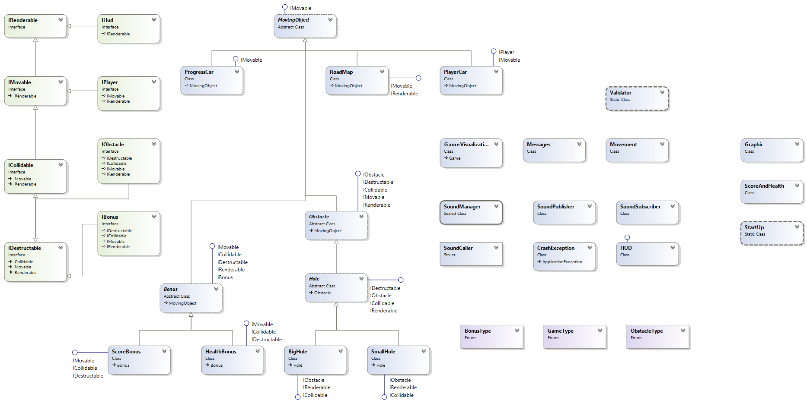

###

OOP Team "Belokk" - Ninja Racer

========================================

(Documentation)

----------------------------------------

####  [Github repository](https://github.com/Belokk/Team-Work)

This is the documentation for the team work assignment for the OOP course of Telerik Academy. The main idea of the project was to simulate a company’s working environment by having seven people working together on a project and to motivate the students to show what they’ve learned during the course. 

### Summary of the game:

A rather simple, yet very entertaining to play 2d racing game, inspired from "Road Fighter" - an old NES Game(8 bit), created using the Monogame framework for Visual Studio(based on Microsoft's XNA game studio)
The Main goal of the game is to survive and ultimately reach your goal - become the Ninja Racer. To make the Game more interesting, there are obstacles(holes) and bonuses(health and score). The player's car is moved using the "**WASD"** or the **arrow keys**.
There is 8 bit music playing in the background, but, if you wish, you could stop it and resume it anytime by pressing **M**л

### Team members:

| Name        | Username           |
| :------------- |:-------------:|
| Душка Драгоева      |  dushka.dragoeva|
| Мартин Манчев      | Galvaneyes      |
| Даниел Исов| Daniel_Isov     |
| Любомир Руменов | Lyubomir.R |
| Фьодор Скороженко|fredskor|
| Калоян Стефанов|kaloyanchost|
| Евгени Точев|evgenitochev|

#### Class Diagram:

